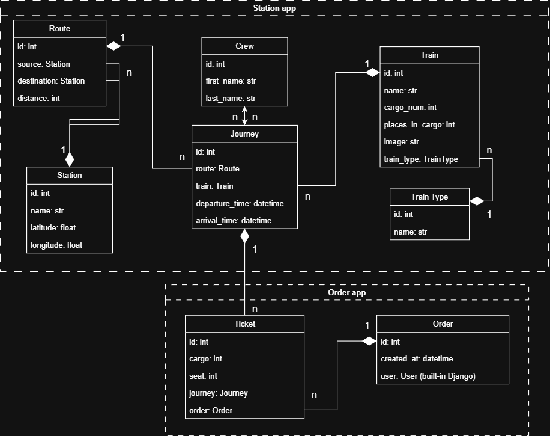

# Train Station API

A REST API for a train station service built with Django Rest Framework. The application provides endpoints for managing train infrastructure (stations, routes, journeys) and a ticket booking system for users. The project is containerized using Docker.

## Key Features

*   JWT-based user authentication (registration & login)
*   Station and route management for administrators
*   Ticket booking system for authenticated users
*   Advanced filtering for journeys and orders
*   Image upload functionality for trains
*   Data management via Django Admin interface
---
## Tech Stack

*   **Backend:** Python, Django, Django Rest Framework
*   **Database:** PostgreSQL
*   **Containerization:** Docker, Docker Compose
*   **Authentication:** djangorestframework-simplejwt
*   **API Documentation:** drf-spectacular
---

## API Documentation

A static preview of the API documentation is available on SwaggerHub. The interactive version for API testing runs locally.

*   [**SwaggerHub Preview**](https://app.swaggerhub.com/apis-docs/asdf-275/TrainStationAPI/1.0.0)
*   **Local Interactive Docs:** `http://127.0.0.1:8000/api/docs/`
---
## Database Schema



---


## Running Locally

This project requires Docker to run. Ensure it is installed before proceeding.

1.  **Clone the repository:**
    ```bash
    git clone https://github.com/rpk6432/train-station-api.git
    cd train-station-api
    ```

2.  **Create and configure the environment file:**
    Copy the provided `.env.sample` file to `.env`. You must provide your own `SECRET_KEY` in this file.
    ```bash
    cp .env.sample .env
    ```

3.  **Build and run the application:**
    Use Docker Compose to build the images and start the services.
    ```bash
    docker-compose up --build
    ```

4.  **Accessing the application:**
    Once the containers are running, the API will be available at:
    *   **API Root:** `http://127.0.0.1:8000/api/`
    *   **Interactive Docs:** `http://127.0.0.1:8000/api/docs/swagger-ui/`
    *   **Admin Panel:** `http://127.0.0.1:8000/admin/`

    *To stop the application, press `Ctrl+C` in the terminal where docker-compose is running, or run `docker-compose down` from another terminal.*